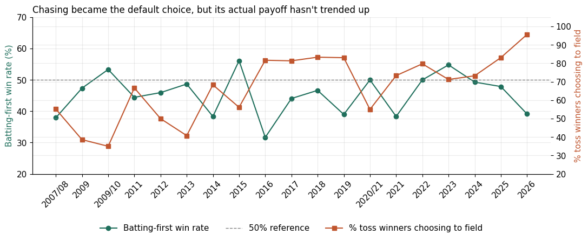
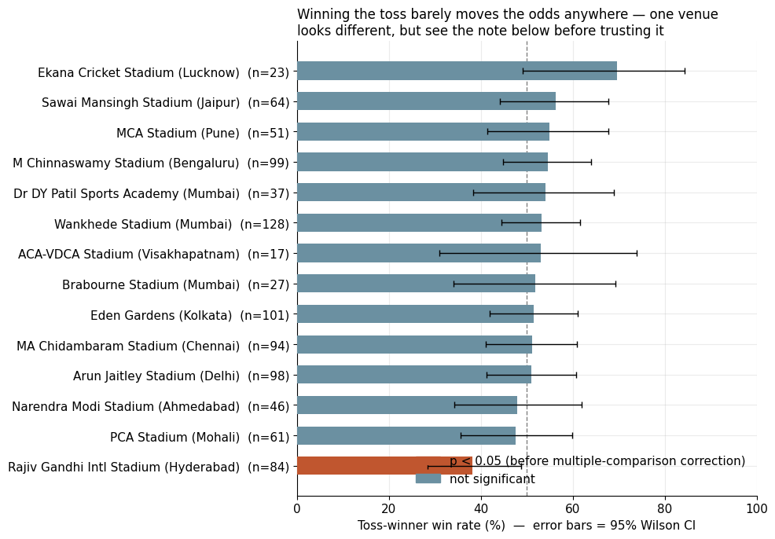

# Does Winning the Toss Actually Matter in the IPL, and Does It Depend on the Venue?

An exploratory data analysis of 1,184 IPL matches (2008 to 2026) built to test a common piece of cricket wisdom: that winning the toss, and the venue you win it at, meaningfully shifts your odds of winning the match.

**Live interactive explorer:** add your published link here once you have it hosted (see below)

**Notebook:** [`IPL_Toss_Venue_EDA.ipynb`](./IPL_Toss_Venue_EDA.ipynb)

## The headline findings

| Question | Finding | Confidence |
|---|---|---|
| Does winning the toss predict winning the match? | No. 51.7%, statistically indistinguishable from a coin flip | High (n=1,184) |
| Does batting first vs fielding first matter? | Yes. Batting first wins only about 46% of matches league wide | High, p=0.005 |
| Has the field first trend actually paid off more over time? | No significant trend, despite the decision becoming near universal | Moderate |
| Does the venue matter? | One venue looks different, but a league wide test across all 14 venues found no significant effect overall | Low, likely noise |
| Do winning margins confirm a venue effect? | No. Margin size does not correlate with a venue's toss win rate | Low signal |
| Is dew or day/night driving any of this? | Cannot be tested directly, the dataset has no match start time field | Data gap, not a finding |

The one finding worth trusting on its own: **batting first is a real, statistically significant disadvantage league wide.** Everything venue specific in this dataset should be treated as a lead to revisit with more seasons of data, not a proven pattern, once you account for how many venues were tested at once.

## What is in this repo

```
.
├── IPL_Toss_Venue_EDA.ipynb   full analysis, executed end to end
├── index.html                 interactive explorer (venue chart, season trend, sortable table)
├── figs/
│   ├── season_trend.png
│   └── venue_toss_winrate.png
├── requirements.txt
└── README.md
```

## Method, in brief

1. **Clean the venue field.** The raw data has 59 distinct venue strings for a much smaller number of actual grounds, since the same stadium gets logged differently across seasons and a few grounds were renamed mid dataset. A manual mapping collapses this to 36 canonical grounds, 14 of which have enough home matches (15+) to analyze on their own.
2. **Roll ball by ball data up to match level.** One row per match: venue, toss decision, final score per innings, and the actual winner. Ties resolved to their super over winner, no result matches (9 of 1,193) dropped since there is no winner to attach a toss effect to.
3. **Test the overall relationship** between winning the toss and winning the match with a two sided binomial test against a 50% baseline.
4. **Break the toss down into its actual decision** (bat first or field first), since that is what a captain controls and what teams have clearly been trending toward over 19 seasons.
5. **Test each venue independently**, then run a chi square test across all venues at once as an honesty check on how many of the individual results are likely noise from running 14 tests at a 5% threshold.
6. **Cross check with margin of victory**, to see whether venues with an apparent toss edge also produce bigger winning margins there. They do not.
7. **State the data limitation plainly.** No day/night or match start time field exists in this dataset, so the commonly cited dew explanation for chasing advantage cannot be tested directly here.

## Key charts





## Data

Ball by ball IPL data, 2008 to 2026 seasons, originally sourced from Cricsheet and distributed via Kaggle as an "IPL Dataset 2008 to 2026" style CSV (roughly 283,000 rows, 105 MB). The raw file is not included in this repo because of its size. To reproduce:

1. Download the dataset from Kaggle (search "IPL ball by ball dataset 2008 2026" or the Cricsheet source directly).
2. Place it in the repo root as `IPL.csv`.
3. Run the notebook top to bottom.

## Running locally

```bash
pip install -r requirements.txt
jupyter notebook IPL_Toss_Venue_EDA.ipynb
```

## Hosting the interactive explorer on GitHub Pages

`index.html` is fully self contained, no build step and no server needed.

1. Push this repo to GitHub.
2. In the repo settings, under Pages, set the source to the main branch, root folder.
3. GitHub will publish it at `https://<your-username>.github.io/<repo-name>/`.
4. Drop that link into this README and into your resume or portfolio.

## Tech

Python, pandas, NumPy, SciPy (binomial tests, chi square), statsmodels (Wilson confidence intervals), Matplotlib, and a small hand built HTML and JavaScript page (SVG charts, no external charting library) for the interactive version.
